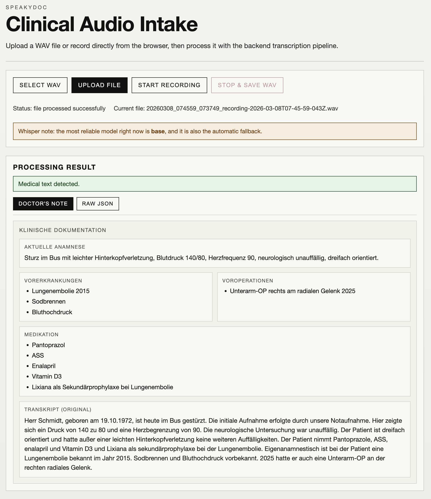

# SpeakyDoc

SpeakyDoc is a small full-stack demo that uploads an audio file, sends it to a Flask backend, and returns structured JSON in a SvelteKit web app.

## Stack

- SvelteKit frontend
- Flask backend
- Python dependency management with `uv`
- Single Docker container

## Instructions for running with Docker

From the project root:

Build the container:
```bash
docker build -t speakydoc .
```

Set the Whisper model name inside the Dockerfi, the default model is "small" :
- Build time (model preload into the image): `--build-arg WHISPER_PRELOAD_MODEL=...`


Larger models (`medium`, `large-v3`) will make the container build take much longer and produce a bigger image and will take longer to process a .wav file during run time, but the quality of the transcription and LLM summary will be better.

Run the project with your OpenAI API key and Whisper model:
```bash
docker run -p 4173:4173 -p 8000:8000 \
-e OPENAI_API_KEY="sk-xxxxx" \
speakydoc
```

Example Whisper models: `base`, `small`, `medium`, `large-v3`.

Open:

- Frontend: http://localhost:4173
- Backend: http://localhost:8000

## Instructions for Local Development

### Backend

Run backend locally with `uv` (outside Docker):
```bash
cd backend
uv sync
export OPENAI_API_KEY="sk-xxxxx"
export WHISPER_MODEL="small"
uv run python -m app.main
```

Runs on http://localhost:8000

WARNING: never commit API keys. Never add `.env` files containing secrets to a container

### Frontend

```bash
cd frontend/speaky-doc-app
npm install
npm run dev
```

Runs on http://localhost:5173

## SpeakyDoc UI
- Click on "Select Wav" and select your .wav file
- Click on "Start Transcription" after selecting the .wav
- Alternatively you can also dictate your own doctors notes. Please have your microphone ready.



## Notes

This project is designed to run locally via Docker. We can expand this project to use local models via ollama or Hugginface.
