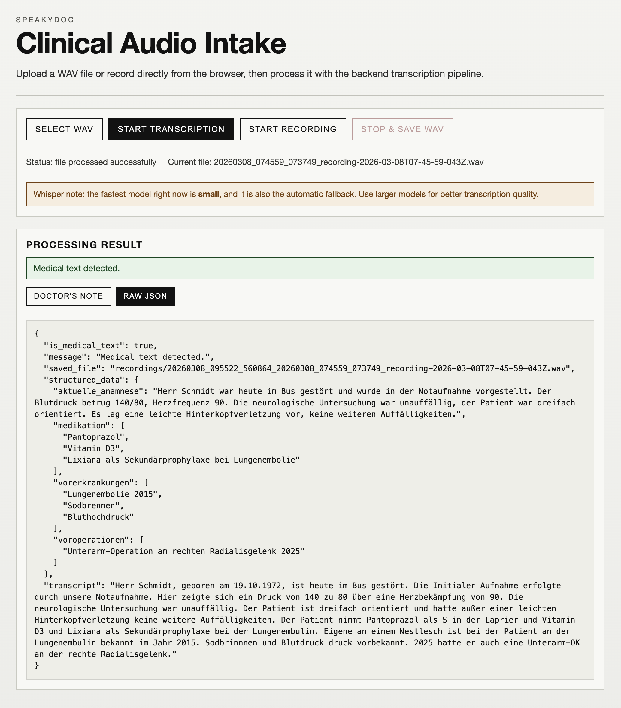

# SpeakyDoc

SpeakyDoc is a small full-stack app that uploads an audio file, sends it to a Flask backend, and returns structured JSON to a SvelteKit front-end. The AI will only accept medical history notes and will reject any other types of transcripts.

## Live Test
The webapp is currently online and running live on a Google Coloud Run container:
https://speaky-doc-ui-232992734624.europe-west1.run.app/

This webapp container has limited resources so it might take a little while to process a .wav file.

If you need a sample audio file of a german medical dictation, you will find one in backend/recordings/PBZ_test_diktat.wav.

Clone this project with this command and then follow the instructions below:
```
git clone git@github.com:pavelbrn/SpeakyDoc.git
```

## Stack

- SvelteKit frontend
- Flask backend
- Python dependency management with `uv`
- Single Docker container

## Instructions for running with Docker

From the project root:

Build the container:
```bash
cd SpeakyDoc
docker build -t speakydoc .
```

If you want to switch the Whisper model, then set a new name inside the Dockerfile, the default model is "small" :
- Look for this variable inside the Dockerfile 
` WHISPER_PRELOAD_MODEL=...`


Larger models (`medium`, `large-v3`) will make the container build take much longer and produce a bigger image. This will take longer to process a .wav file during run time, but the quality of the transcription and LLM summary will be better.

Run the project with your OpenAI API key and Whisper model:
```bash
docker run -p 4173:4173 -p 8000:8000 \
-e OPENAI_API_KEY="sk-xxxxx" \
speakydoc
```

Example Whisper models: `base`, `small`, `medium`, `large-v3`.

Open:

- Frontend: http://localhost:4173
- Backend: http://localhost:8000

## Instructions for Local Development

### Backend

Run backend locally with `uv` (outside Docker):
```bash
cd backend
uv sync
export OPENAI_API_KEY="sk-xxxxx"
export WHISPER_MODEL="small"
uv run python -m app.main
```

Runs on http://localhost:8000

WARNING: never commit API keys. Never add `.env` files containing secrets to a container.

### Frontend

```bash
cd frontend/speaky-doc-app
npm install
npm run dev
```

Runs on http://localhost:5173

## SpeakyDoc UI
- Click on "Select Wav" and select your .wav file.
- Click on "Start Transcription" after selecting the .wav.

- Alternatively you can also dictate your own doctors notes. Please have your microphone ready.
- The WebApp is phone friendly! So you can record using you phones microphone.


- You can also preview the structured JSON output.

## Notes

This project is designed to run locally with Docker. We can expand this project to use local models from ollama or Hugginface.
